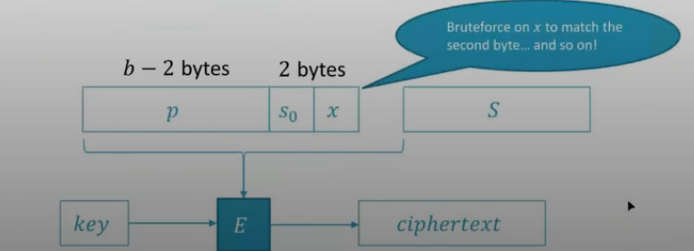

# Crittografia 1

La crittografia è quell'insieme di pratiche per poter offuscare un messaggio e renderlo fruibile solo dal legittimo destinatario.

Ci sono due algoritmi (tipicamente usano una chiave di cifratura come parametro):

- Encryption
- Decryption

I due metodi principali sono:

- Crittografia a chiave simmetrica o privata -> chiave singola
- Crottografia a chiave pubblica o asimmetrica -> due chiavi (pubblica e privata) garantisce una comunicazione sicura bidirezionale.

## Crittografia simmetrica

La crittografia simmetrica nasce nel 1976 da Diffie e Hellman.
Queste tipologie di algoritmi di crittografia si basano su trasposizioni e replacement; inoltre è necessario conoscere la stessa chiave che deve essere la medesima.

La criptoanalisi è quell'insieme di tecniche che consentono di decifrare una stringa senza conoscere la chiave.

### Cifrario di cesare

Non ha una chiave, avviene uno shift di 3 per ogni carattere.

### Cifrario di Vigenere

Si usano 26 cifrari a shift differenti, creando una tabella.

Se inoltre si usa anche una chiave segreta come cafe, si gestisce nel seguente modo:

I problemi chiave sono:

1. Lunghezza della chiave
2. Casualità della chiave
3. Riutilizzo della chiave

### Principi di Kerchoffs

- Encryption scheme (cifratura e decifratura) non è segreto:
  - L'attaccante conosce tutto fatta eccezione della chiave.

### Tipologie di attacco

- Ciphertext only: conosce solo il testo cifrato
- Known plaintext: conosce un gruppo di testi cifrati e alcuni decifrati
- Chosen plaintext: cifra un messaggio che sceglie lui e ottiene altre informazioni
- Chosen chiphertext: può selezionare il ciphertext
- Chosen text: sceglie il testo e la cifratura
- brute force: si provano tutte le chiavi possibili finchè non riusciamo a decifrare, occorre però il riconoscimento della stringa decifrata se ha senso compiuto o meno.

### Livello di sicurezza:

- Sicurezza incondizionabile: siamo sicuri che quel messaggio non verrà mai decifrato
- Sicurezza computazionale: dopo una fase di analisi è in grado di capire quanta sicurezza può garantire una cifratura
- Computer quantici: (possibile futuro, attualmente un concetto astratto)

### Principi di Shannon's

Shannon stabilisce due concetti chiave:

- Confusione
  - Usando la chiave l'informazione si deve distribuire su tutto il testo cifrato, ogni bit di testo cifrato deve dipendere da ogni bit della chiave.
- Diffusione
  - Manipola il testo usando la chiave (replace e permutazioni)

La cifratura perfetta: Ogni messaggio cifrato si deve poter ottenere da un messaggio in chiaro con la stessa probabilità che data dal numero di chiavi.

PT = Spazio del testo in chiaro
CT = Spazio del testo cifrato
K = Spazio delle chiavi

|PT| = |CT| = |K|

1. Lungezza chiave -> teorema shannon
2. Casualità della chiave -> teorema shannon
3. Riutilizzo della chiave -> (MTP Many-Time Pad attack)

### Many-Time Pad attack

Proprio per questo principio sopra elencato andando a sommare i caratteri in XOR otteniamo gli spazi dei nostri messaggi... capendo questo è un passo avanti verso la decifratura dei messaggi.
(Evitare di usare la stessa chiave più volte)

## Cifrario a blocco

L'algoritmo divide il messaggio da cifrare in blocchi delle stesse dimensioni e li cifra separatamente secondo la chiave data.

La chiave data dall'utente viene espansa dall'algoritmo.

### DES (Data Encryption Standard)

Blocchi da 64bit e chiavi da 56bit.
La chiave data dall'utente a 56 bit con un algoritmo viene espansa e prodotto 16 chiavi diverse ognuna lunghe 48 bit.
Successivamente ci sono 16 cicli di una funzione che viene iterata.

La funzione esegue la cifratura, il blocco da 64 bit viene diviso in due. Il blocco da 32 bit viene espanso in 48 bit, e la mia vhiave di ciclo la sommo bit a bit con questa chiave. Questi 48 bit li divido in blocchi da 6 e otteniamo di nuovo un blocco da 32 bit.

L'unica debolezza nota del DES è la chiave.

### 3DES

Ha tre chiavi DES quindi una chiave da 168 bit (56 \* 3).
La cifratura funziona in questo modo: si cifra il messaggio con DES prima con la chiave 3, poi si decifra con la chiave 2 e poi si ricifra con la chiave 1.
Se prendo k1 = k2 = k3 il 3DES è compatibile anche con DES.

### 2DES

E' vulnerabile all'attacco Meet-in-the-Middle. Chiave da 112bits

### AES

AES non ci sono attacchi ancora disponibili.
Si parte da un testo in chiaro, un blocco è di 128 bit, i quali vengono messi in una matrice 4 \* 4.

- SubBytes viene eseguito 1/m + c.
- ShiftRows sposta ogni elemento di in base all'indice j
- MixColumns fa il mix delle colonne
- AddRoundKey viene eseguito lo XOR bit a bit tra messaggio e chiave.

## Tipologie di Attacchi

Gli oracoli sono dei server ai quali chiediamo

### ECB Oracle Attack

- P testo scelto
- S è una stringa segreta che conosce l'oracolo
- || è l'operatore che concatena le stringhe.

Se avessimo fatto un bruteforcing avremmo avuto 2^128 tentativi, mentre invece con ECB Oracle avremmo fatto solo 256 \* 16 = 2^12.

### Padding

Se un testo è più corto della lunghezza prevista, allora aggiungeremo il byte avente al suo interno il numero di posizioni mancanti.

### CBC Mode of Operation

CBC Strategia:

### Padding Oracle Attack

Il Padding Oracle Attack è un attacco crittografico che sfrutta il modo in cui alcuni sistemi gestiscono la crittografia simmetrica con padding. Questo attacco è particolarmente efficace contro gli schemi di cifratura a blocchi come AES-CBC e DES-CBC, che utilizzano il PKCS#7 padding.

Funzionamento del Padding:
Molti algoritmi di cifratura a blocchi operano su blocchi di lunghezza fissa (es. AES: 16 byte). Se il testo in chiaro non è un multiplo della dimensione del blocco, viene applicato un padding, ad esempio:

| Dati (Byte)      | Padding PKCS#7                                         |
| ---------------- | ------------------------------------------------------ |
| "Hello" (5 byte) | 0x0B 0x0B 0x0B 0x0B 0x0B 0x0B 0x0B 0x0B 0x0B 0x0B 0x0B |

#### Il Problema: L'Oracolo del Padding

Un sistema vulnerabile può fornire feedback sullo stato della decifratura:

- Errore di padding → il padding è errato.
- Errore di autenticazione → il padding è corretto, ma l'autenticazione fallisce.

Se un attaccante può distinguere tra questi due errori, può gradualmente decifrare un testo cifrato senza conoscere la chiave.

#### Passaggi dell'Attacco

1. Manipolazione del Ciphertext
   L'attaccante modifica l'ultimo byte del penultimo blocco e osserva la risposta del sistema:

   - Se il padding è corretto, l'ultimo byte decifrato ha un valore valido.
   - Se il padding è errato, l'attaccante riprova con un altro valore.

2. Ricostruzione del Testo Decifrato:
   Dopo aver scoperto l'ultimo byte, l'attaccante ripete l'operazione per i byte precedenti, usando le proprietà del padding PKCS#7.

3. Decifratura Completa
   Dopo aver trovato un intero blocco, il processo si ripete per i blocchi precedenti, consentendo la decifratura dell'intero messaggio.

#### Contromisure

Per proteggersi dal Padding Oracle Attack, si possono adottare le seguenti misure:

- Utilizzare cifratura autenticata come AES-GCM o AES-CCM.
- Non esporre errori di padding e restituire messaggi di errore generici.
- Implementare il decryption-time costante, evitando tempi di risposta variabili.

### Bit-Flipping Attack

Il **Bit-Flipping Attack** è una tecnica che permette di modificare i dati cifrati senza conoscere la chiave di cifratura. Questo attacco sfrutta la modalità **Cipher Block Chaining (CBC)** utilizzata in algoritmi come **AES-CBC**.

#### Funzionamento dell'Attacco

1. Struttura della Cifratura CBC
   Nella modalità **CBC**, ogni blocco cifrato dipende dal blocco precedente:

   \[
   P*n = D_K(C_n) \oplus C*{n-1}
   \]

   Se un attaccante modifica \( C\_{n-1} \), il valore di \( P_n \) cambierà dopo la decifratura.

2. Obiettivo dell'Attacco
   Se il testo cifrato contiene dati strutturati (es. JSON, cookie di autenticazione), un attaccante può alterare i bit del **ciphertext** per modificare il **plaintext**.

3. Esempio Pratico
   Supponiamo che il testo in chiaro prima della cifratura sia: user=guest;
   Un attaccante potrebbe alterare i bit in modo da ottenere: user=admin;

#### Contromisure

Per proteggersi da questo attacco:

1. **Utilizzare cifratura autenticata** (AES-GCM, AES-CCM).
2. **Validare i dati dopo la decifratura** con checksum o firme digitali.
3. **Non fidarsi dei dati decifrati** senza verifica aggiuntiva.
