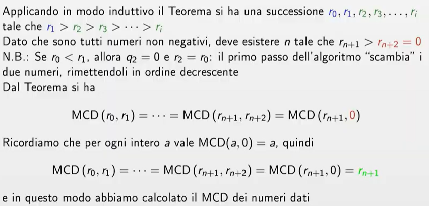

# Crittografia 2

### L'algoritmo euclideo

Calcola il MCD di due numeri e lo esprime come combinazione dei numeri dati.
L'algoritmo nasce dal teorema di Euclide.

### Algoritmo Square and Multiply

## Crittografia asimmetrica

La crittografia asimmetrica utilizza due chiavi:

- Chiave pubblica (condivisa con chiunque).
- Chiave privata (segreta e conosciuta solo dal proprietario).

I messaggi cifrati con una chiave pubblica possono essere decifrati solo con la corrispondente chiave privata e viceversa.

Alcuni algoritmi di crittografia:

- Merkle puzzles
- Diffie-hellman
- RSA
- Identity-based encryption
- Functional encryption

### TTP (Trusted Third Party)

Una TTP viene utilizzata per:

- Certificare le chiavi pubbliche (Autorità di Certificazione - CA).
- Mediare lo scambio di chiavi per garantire l'autenticità delle parti.
- Gestire la risoluzione di dispute in sistemi crittografici avanzati.

Immaginiamo che Alice voglia comunicare con Bob in modo sicuro ma non si fidano reciprocamente.

1. Alice e Bob si registrano presso una TTP, che fornisce loro chiavi pubbliche e private.
2. La TTP rilascia certificati digitali, firmati con la sua chiave privata, per autenticare le chiavi pubbliche di Alice e Bob.
3. Quando Alice vuole inviare un messaggio a Bob:
   - Recupera la chiave pubblica di Bob dal certificato emesso dalla TTP.
   - Cifra il messaggio con la chiave pubblica di Bob.
   - Bob, con la sua chiave privata, decifra il messaggio.
4. Bob può verificare l'autenticità della chiave pubblica di Alice controllando la firma della TTP.

### Merkle Puzzles

I Merkle Puzzles sono un metodo crittografico proposto da Ralph Merkle nel 1974 per permettere a due parti di stabilire una chiave segreta senza aver mai comunicato prima. Il loro obiettivo è garantire uno scambio sicuro di chiavi senza la necessità di un canale sicuro a priori.

L'idea chiave è che il mittente crea un gran numero di puzzle crittografici e il destinatario ne risolve uno a caso per ottenere una chiave segreta.

Passaggi del Protocollo

1. Creazione dei Puzzle (Mittente - Alice)
   - Alice crea N puzzle crittografici.
   - Ogni puzzle contiene una chiave segreta casuale Kᵢ e un identificatore i.
   - Il puzzle è progettato in modo che decifrarlo richieda un certo lavoro computazionale (es. trovare un pre-immagine di una funzione crittografica).
   - Alice invia tutti i puzzle a Bob in chiaro.
2. Risoluzione di un Puzzle (Destinatario - Bob)
   - Bob sceglie un puzzle a caso e lo risolve.
   - Una volta risolto, Bob ottiene la chiave Kⱼ (associata al puzzle risolto).
   - Poiché ha scelto a caso, Alice non sa quale puzzle ha risolto Bob.
3. Uso della Chiave per la Comunicazione Sicura
   - Bob comunica ad Alice l'identificatore j del puzzle scelto.
   - Alice conosce la chiave Kⱼ associata e ora entrambi condividono una chiave segreta.
   - Possono ora utilizzare Kⱼ per crittografare messaggi con un cifrario simmetrico (es. AES).

Sicurezza e Attacchi
L'idea di sicurezza nei Merkle Puzzles si basa su un gap computazionale tra il destinatario legittimo e un attaccante:

- Bob risolve solo un puzzle, quindi il suo lavoro computazionale è O(1).
- Eve (attaccante) deve cercare di risolvere tutti i puzzle per intercettare la chiave, quindi il suo lavoro computazionale è O(N).

Se N è abbastanza grande, per un attaccante diventa impraticabile risolvere tutti i puzzle.

### Diffie ed Hermann

Il protocollo Diffie-Hellman (DH) è un metodo per lo scambio sicuro di chiavi tra due parti su un canale insicuro. È stato inventato nel 1976 da Whitfield Diffie e Martin Hellman e permette a due persone di generare una chiave segreta condivisa senza che un intercettatore possa scoprirla.

Diffie-Hellman permette a due parti (Alice e Bob) di creare una chiave segreta condivisa senza trasmetterla direttamente. Questa chiave può poi essere usata per cifrare la comunicazione con algoritmi simmetrici come AES.

L'algoritmo sfrutta l'aritmetica modulare e l'esponenziazione per rendere difficile per un attaccante ricostruire la chiave segreta.

1. Scelta dei parametri pubblici (da tutti)
   - Si sceglie un numero primo **p** (grande).
   - Si sceglie una base (o generatore) **g** tale che **1 < g < p**.
   - Questi due numeri **p** e **g** sono pubblici e possono essere conosciuti da chiunque.
2. Generazione delle chiavi private

   - **Alice** sceglie un numero segreto **a** e calcola:

     \[ A = g^a \mod p \]

   - **Bob** sceglie un numero segreto **b** e calcola:

     \[ B = g^b \mod p \]

   - Le chiavi **a** e **b** sono private e non vengono mai trasmesse.

3. Scambio delle chiavi pubbliche
   - **Alice** invia **A** a Bob.
   - **Bob** invia **B** ad Alice.
   - Ora, Alice conosce **B**, e Bob conosce **A**.
4. Calcolo della chiave condivisa

   - **Alice** calcola la chiave segreta:

     \[ S = B^a \mod p = (g^b \mod p)^a \mod p = g^{ba} \mod p \]

   - **Bob** calcola la chiave segreta:

     \[ S = A^b \mod p = (g^a \mod p)^b \mod p = g^{ab} \mod p \]

   - Poiché \( g^{ba} \equiv g^{ab} \), entrambi ottengono la **stessa chiave segreta S**.

Ora, Alice e Bob hanno una chiave condivisa che possono usare per cifrare la comunicazione con un algoritmo simmetrico (es. AES).

Vulnerabilità e Miglioramenti

1. Attacco Man-in-the-Middle (MITM)
   - Un attaccante potrebbe intercettare A e B e sostituirli con i propri valori.
   - Soluzione: usare Autenticazione con firme digitali o certificati.
2. Attacco del Logaritmo Discreto
   - Se p è troppo piccolo, si può calcolare il logaritmo discreto con attacchi avanzati.
   - Soluzione: usare numeri primi molto grandi (2048+ bit).
3. Diffie-Hellman a Curve Ellittiche (ECDH)
   - Versione più sicura ed efficiente che usa curve ellittiche invece di esponenziazione modulare.

### RSA

L'algoritmo **RSA (Rivest-Shamir-Adleman)** è uno dei metodi più utilizzati per la **crittografia asimmetrica**. Viene usato per garantire **confidenzialità, autenticazione e firma digitale**.

RSA si basa sulla **difficoltà di fattorizzare numeri grandi**. Il suo funzionamento si divide in tre fasi:

1️⃣ **Generazione delle chiavi**

1. Scegli due numeri primi molto grandi:  
   \[
   p \quad \text{e} \quad q
   \]
2. Calcola il loro prodotto:  
   \[
   n = p \cdot q
   \]
   Il numero **n** sarà usato come modulo nelle operazioni crittografiche.
3. Calcola la funzione di Eulero:  
   \[
   \varphi(n) = (p-1) \cdot (q-1)
   \]
4. Scegli un numero **e** tale che:  
   \[
   1 < e < \varphi(n) \quad \text{e} \quad \gcd(e, \varphi(n)) = 1
   \]
   (ovvero, **e** è coprimo con **𝕑(n)**).
5. Calcola **d**, l'inverso moltiplicativo di **e** modulo **𝕑(n)**:  
   \[
   d \equiv e^{-1} \mod \varphi(n)
   \]
   Questo significa che:  
   \[
   d \cdot e \equiv 1 \mod \varphi(n)
   \]

🔑 **Chiavi generate:**

- **Chiave pubblica**: \( (e, n) \)
- **Chiave privata**: \( (d, n) \)

---

2️⃣ **Cifratura**

Per cifrare un messaggio **M** (convertito in un numero):  
\[
C = M^e \mod n
\]
Il testo cifrato **C** può essere inviato in modo sicuro.

---

3️⃣ **Decifratura**

Per recuperare il messaggio:  
\[
M = C^d \mod n
\]
Solo chi possiede **d** (chiave privata) può decrittare il messaggio.

---

🔒 **Perché RSA è Sicuro?**

- Basato sulla difficoltà della **fattorizzazione di numeri grandi**: trovare **p** e **q** conoscendo **n** è computazionalmente difficile.
- Con numeri sufficientemente grandi (2048+ bit), anche i supercomputer non possono romperlo in tempi ragionevoli.

### Identity-Based Encryption

Identity-Based Encryption (IBE): Crittografia Basata sull'Identità

L'**Identity-Based Encryption (IBE)** è un tipo di crittografia asimmetrica in cui la **chiave pubblica** di un utente è un identificatore univoco, come un'**email, un numero di telefono o un nome utente**. Questo elimina la necessità di una Public Key Infrastructure (PKI) tradizionale per la distribuzione delle chiavi pubbliche.

⚙ **Come Funziona l'IBE?**  
L'IBE si basa su una **Trusted Authority (TA)** o **Private Key Generator (PKG)** che genera e distribuisce le chiavi private in base all'identità dell'utente. Il sistema segue quattro passaggi principali:

1️⃣ **Setup (Inizializzazione del sistema)**

- Il **PKG** genera una chiave **maestra segreta (MSK)** e un **parametro pubblico (MPK)**.
- **MPK** viene distribuito pubblicamente a tutti gli utenti.

2️⃣ **Key Generation (Generazione della chiave privata)**

- Un utente fornisce la propria **identità (ID)** al PKG.
- Il PKG usa la **MSK** per generare la **chiave privata** corrispondente a quella identità e la invia in modo sicuro all'utente.

3️⃣ **Encryption (Cifratura del messaggio)**

- Il mittente usa il **parametro pubblico (MPK)** e l’**identità (ID)** del destinatario per cifrare il messaggio.
- Il messaggio cifrato può essere inviato senza che il destinatario abbia ancora la chiave privata.

4️⃣ **Decryption (Decifratura del messaggio)**

- Il destinatario usa la propria **chiave privata** per decifrare il messaggio ricevuto.

🔒 **Vantaggi e Svantaggi di IBE**

✅ **Vantaggi**:

- **Nessuna distribuzione di chiavi pubbliche**: Le chiavi pubbliche sono identità facilmente riconoscibili.
- **Maggiore flessibilità**: Utenti possono ricevere messaggi cifrati **prima** di ottenere una chiave privata.

❌ **Svantaggi**:

- **Dipendenza dal PKG**: Il PKG deve essere affidabile e sicuro (single point of failure).
- **Problemi di revoca**: Se una chiave privata viene compromessa, revocarla e gestire nuove chiavi può essere complesso.

### Functional Encryption (FE): Crittografia Funzionale

La **Functional Encryption (FE)** è un'evoluzione della crittografia tradizionale che consente a un destinatario di ottenere **solo** alcune informazioni da un dato cifrato, senza poterlo decriptare completamente.

⚙ **Come Funziona la Functional Encryption?**

A differenza della crittografia classica, in cui una chiave privata permette di decriptare un messaggio intero, la **FE** permette di recuperare **solo un risultato specifico** da un dato cifrato.

Il sistema segue quattro passaggi principali:

1️⃣ **Setup (Generazione delle chiavi di sistema)**

- Un'autorità centrale genera una **chiave maestra segreta (MSK)** e un **parametro pubblico (MPK)**.
- **MPK** è distribuito a tutti gli utenti.

2️⃣ **Encryption (Cifratura del messaggio)**

- Un mittente cifra un messaggio **M** usando **MPK** per ottenere il **testo cifrato C**.
- Il messaggio cifrato può essere inviato a più destinatari.

3️⃣ **Key Generation (Generazione della chiave privata funzionale)**

- L'autorità centrale genera **chiavi private personalizzate** basate su una **funzione f()** e l'identità dell'utente.
- Questa chiave consente di estrarre **solo il risultato di f(M)** dal dato cifrato.

---

4️⃣ **Decryption (Decifratura selettiva del messaggio)**

- Un destinatario con una chiave privata per **f()** può calcolare **f(M)** direttamente dal testo cifrato **C**, senza decifrare **M** completamente.

🔒 **Perché Functional Encryption è utile?**

✅ **Maggiore controllo sui dati**: Un utente può accedere solo alle informazioni autorizzate.  
✅ **Privacy avanzata**: Permette il calcolo su dati cifrati senza rivelare il contenuto completo.  
✅ **Protezione dei dati sensibili**: Utile in scenari di analisi su dati medici o finanziari.

📌 **Applicazioni della Functional Encryption**

✅ **Data Sharing Sicuro**: Consente di condividere informazioni parziali senza esporre l'intero dataset.  
✅ **Machine Learning su dati cifrati**: Permette di addestrare modelli senza decriptare i dati originali.  
✅ **Access Control Avanzato**: Utile in scenari aziendali con livelli di accesso differenziati.
