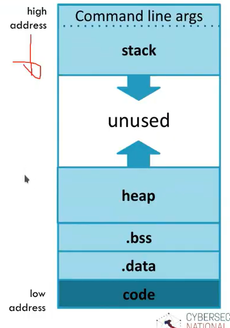
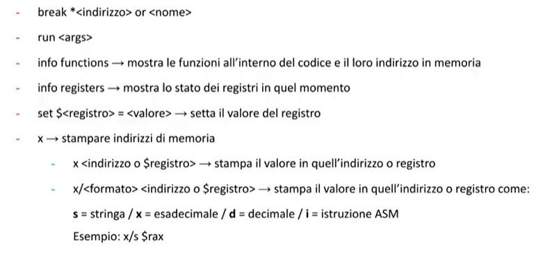

# Software 0

Quando scriviamo un programma scriviamo il codice sorgente, quando lo compiliamo eseguiamo i seguenti passaggi, (noi facciamo riferimento al compilatore gcc):

- preprocessing: sostituzione delle MACRO con il testo associatio
- compilazione: traduzione del codice in istruzioni assembly
- assembly: dal codice assembly viene tradotto in codice oggetto (hello.o)
- linking:
  - Statici: Tutta la libreria la importo nel file binario generato alla fine della compilazione.
  - Dinamici: quando dovrai chiamare la printf ci penserà il SO a farti avere il codice della printf.

Come è fatto questo formato di file ELF, per i file oggetto (noi ci concentriamo sui file eseguibili).
Questo ELF si può schematizzare nel seguente modo:

- ELF header: descrive il contenuto del file
- Program header table: fornisce informazioni su come creare una immagine di un processo
- Sections: Contiene cosa è necessario per il linking
- Section header table: descrizione della precedente sections

Come sono fatte le ELF sections e cosa contengono:

L'architettura del processore x86, che contiene 8 registri ognuno della dimensione di 32 bit.

L'architettura x64 ha la dimensione dei registri di 64 bit.
Ma sono presenti anche altri registri molto più grandi un esempio anche fino a 512 bit.

Alcune istruzioni assembly note del x86:

- mov op1, op2: copia i due elementi da sorgente a destinazione
- push op1: Aggiunge un elemento sulla cima dello stack
- pop op1: Ricordati che lo stack è di tipo LIFO, rimuove dalla cima dello stack
- lea op1, op2: load dell'indirizzo di memoria indicato da op2 nel registro specificato da op1.
- add op1, op2
- sub op1, op2
- and op1, op2
- or op1, op2
- xor op1, op2
- jump op: salto all'istruzione
- j<condition> op: in base alla condizione definite fa cose

Quando noi scriviamo un programma noi usiamo delle tipologie di dato precise, senza sapere come vengono rappresentate in memoria, tantomeno dove.
In C rispetto ad altri linguaggi lavoriamo anche con i puntatori a memoria.
Il compilatore non memorizza sempre i dati in memoria vicini tra loro, alle volte si possono ottimizzare e quindi in base a come compiliamo potrebbe essere differente l'ordine dei dati o l'aggiunta di padding.

Vediamo ora cos'è un processo in memoria.
Un processo memorizza i dati e il codice necessario per eseguire quei processi.

Lo stack è composto da più stackframe che contiene le informazioni per le chiamate a funzione, quando la funzione termina viene tolta.
L'architettura dello stack dipende dal sistema operativo, dall'architettura e dal compilatore.

Nelle architetture noi nel registro ESP abbiamo il puntatore all'ultimissimo elemento dello stack.
In ogni Stack frame troviamo gli argument, il return address, il frame pointer(ci dice dove iniziano le variabili locali di questo frame) e le variabili locali.

C declaration è una calling convention che viene usata in molti compilatore x86 che spiega come vengono inseriti gli argomenti sullo stack e come viene fatto il return.

Un altra struttura fondamentale per la gestione dei processi è l'heap. Mentre lo stack server per la gestione delle chiamate a funzione, l'heap è una struttura che serve per allocare variabilid i tipo dinamico.
Le variabili inserite nell'Heap hanno un tempo di vita maggiore del frame nel quale viene dichiarato. L'Heap dipende dai linguaggi di programmazione, in C viene usato quando usiamo istruzioni come malloc(int) e free(void\*)
In python ad esempio non mi occupo della gestione della memoria, viene usato il suo garbage collector che mi libera la memoria.

## Strumenti

### ELF

I file binari, come leggere i dati ELF:

- strings: Strumento che raccoglie tutte le stringhe interne ad un file binario (prese le sequenze di almeno 4 caratteri stampabili e le mostrano a video, quest'ultime però devono terminare con caratteri speciali come '/0'). Da queste stringhe noi potremmo trovare delle password o caratteristiche simili. flag:
  - -d, -n, -h, --help
- objdump: Una o più informazioni su uno o più file oggetto come l'header di un object file:
  - flag: -f, -h, -D (Disassambly), --help
- readelf: Possiamo vedere le informazioni del nostro elf header:
  - flag: -h, -s, --help

### GDB

Per scorprire di più si può usare GDB per debuggare il programma:

- gdb <program>

Una volta eseguito il programma con GDB possiamo eseguire dei comandi che ci permettono di fare diverse cose:

Quando un programma si ferma su un breakpoint è fondamentale ispezionare lo stack ed il suo stack frame, il comando è (info frame).

Comando disas permette di disassemblare l'eseguibile e vedere la lista di istruzioni assembly.

Comadno print per stampare: print {nome_variabile}

### GEF

Estende le capacità di GDB che rende migliore la visualizzazione dei dati di GDB e consente di fare analisi dinamiche.

### pwntools

Attraverso tube noi possiamo inviare ricevere e manipolare dati.
Attraverso un eseguibile possiamo passare variabili d'ambiente, eseguirlo...

Supporta anche le sessioni ssh.

### Ghidra

Dall'assembly cerca di ricostruire un il codice sorgente.
Usato per il RE.

## Identificare le vulnerabilità

- Dove un programma richiede un input e se viene validato
- Se la memoria è gestita in modo sicuro
- se vengono usate librerie di terze parti
- come viene compilata una applicazione
- se una stringa statica che contiene dati sensibili

