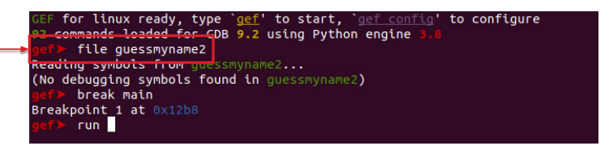
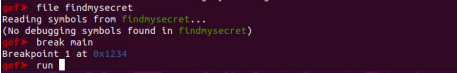

# Software 1

Una vulnerabilità è una debolezza che può essere sfruttata da un aggressore per eseguire azioni non autorizzate all'interno del programma.
Per sfruttare una vulnerabilità, un aggressore si affida a strumenti e tecniche correlate a una debolezza del software.
In questo contesto, la vulnerabilità è anche nota come superficie di attacco.

Le vulnerabilità sono più generali dei bug. Secondo la terminologia IEEE1:

- Bug: un errore o un guasto che causa un guasto
- Error: un'azione umana che produce un risultato errato
- Fault: una definizione errata di un passaggio, processo o dato in un programma per computer
- Failure: l'incapacità del software di eseguire le funzioni richieste entro i requisiti prestazionali specificati

La maggior parte delle vulnerabilità sono conseguenze di errori o scelte sbagliate nello
sviluppo del software. La prima (e principale) contromisura per evitare le vulnerabilità del software è sviluppare un buon software.

Best Practice:

1. Più semplice è, meglio è... mantieni semplice il tuo codice!
2. Non è tutto oro ciò che luccica... tieni traccia delle ipotesi fatte in fase di progettazione e verificale a runtime
3. Il male viene sempre dai dettagli... testa sempre il tuo codice!
4. Se pensi che l'istruzione sia costosa, prova l'ignoranza... dedica del tempo a imparare e a studiare la soluzione e la tecnologia giusta per il tuo software

## Vulnerabilità

### Information leakage

Le informazioni vengono divulgate involontariamente all'utente finale e utilizzate dagli aggressori per violare la sicurezza dell'applicazione.

Un esempio è una password in hardcodata e non hashata all'interno del codice.

### Buffer Overflow

Le operazioni di scrittura sui dati possono superare i limiti del buffer e sovrascrivere le posizioni di memoria adiacenti.
Questo può causare:

- esecuzione di codice dannoso
- escalation dei privilegi

### Race condition

La piccola finestra temporale tra l'applicazione di un controllo di sicurezza e l'utilizzo dei servizi in un sistema consente di modificare il comportamento del programma.
È il risultato di interferenze tra più thread in esecuzione nel sistema e che condividono le stesse risorse.

Esempio classico:

1. Il programma controlla se un utente ha i permessi per accedere/modificare un file.
2. Poco dopo, usa effettivamente quel file.

Se un attaccante riesce a modificare il file (o un collegamento simbolico, o un valore condiviso) tra il controllo e l’uso, può aggirare il controllo di sicurezza.

### Invalid data processing

I dati vengono elaborati con presupposti errati o parziali che consentono all'aggressore di abilitare comportamenti indesiderati o eseguire codice dannoso

## Static and Dynamic Analysis

### Static Analysis

L'analisi statica dei programmi è l'analisi del software per computer che viene eseguita senza effettivamente eseguire i programmi, in contrasto con l'analisi dinamica, che viene eseguita sui programmi durante la loro esecuzione.
L'analisi statica può essere eseguita su...

- il codice sorgente
- il codice oggetto

In questo modulo, ci concentreremo sull'analisi statica eseguita sul codice oggetto.

Questi strumenti possono essere utilizzati per raccogliere informazioni da file binari che possono essere utilizzati per scoprire vulnerabilità.
Tools:

- objdump
- readelf
- strings

Dato un file binario, possiamo:

- verificare se il file è eseguibile o meno
- scoprire l'architettura per cui è stato compilato il binario
- raccogliere simboli e stringhe utilizzati nel programma
- verificare se è presente un processo in esecuzione associato al binario
- leggere l'SHA di un file e verificare se è associato a software dannoso
- identificare i nomi delle funzioni e le librerie utilizzate

Le informazioni raccolte dai file binari possono essere utilizzate per scoprire le vulnerabilità del programma:

- dove un programma riceve un input e se questo viene convalidato
- se la memoria è gestita in modo sicuro
- se vengono utilizzate librerie aggiornate o framework di terze parti
- come viene compilata l'applicazione
- se vengono utilizzate stringhe (statiche) per registrare dati sensibili

### Dynamic Analysis

L'analisi dinamica è una tecnica di analisi del programma eseguita su processori virtuali o reali.
Questo tipo di analisi viene eseguita utilizzando strumenti in grado di osservare l'esecuzione del programma:

- analisi della memoria dinamica
- disassemblaggio dinamico

Lo strumento **ltrace**, che consente di tracciare le chiamate alle librerie:

È possibile limitare l'analisi dinamica utilizzando tecniche anti-debug. L'idea è quella di eseguire codice specifico che causa errori quando un debugger tenta di tracciare un programma. Uno degli approcci più semplici è quello basato sul self-debugging.

Nel self-debugging viene creato un nuovo processo per tracciare l'esecuzione del nostro programma (come un debugger).
Viene utilizzata la funzione ptrace. Se un debugger è in esecuzione, viene generato un errore e il programma termina.
In C, l'auto-debug è implementato basandosi sulla funzione ptrace disponibile in sys/ptrace.h.

Possiamo comunque usare un debugger per bypassare il self-debugging. Dobbiamo solo:

- Trovare dove viene invocato ptrace
- Lasciare che il debugger salti questa invocazione

Esistono tecniche di reverse engineering che possono aiutare in questo compito

Dopo aver utilizzato uno strumento come Ghidra, possiamo usare gdb per chiamare una delle funzioni del programma.
Per prima cosa, dobbiamo caricare il programma e impostare un breakpoint nel main:

Dopodiché possiamo chiamare la funzione functionOne() e scoprire il segreto:

