# Software 2

## Memory corruption

Attacchi di corruzione della memoria

- Buffer overflow
- Stack corruption
- Heap overflow
- Shellcode injection
- Rilevamento e prevenzione

Le tecniche di corruzione della memoria sono una delle più antiche forme di vulnerabilità.
Le posizioni di memoria possono essere modificate per alterare il comportamento previsto di un programma.
Gli attacchi di corruzione della memoria si basano principalmente sul buffer overflow

### Buffer overflow e variable overriding

Errori tipici con array, puntatori e stringhe sono:

- Accesso oltre i limiti dell'array
- Copia di una stringa in un buffer troppo piccolo
- Puntatore che fa riferimento a una posizione errata
- Questi errori possono modificare l'esecuzione del programma
- Possono essere utilizzati anche da un aggressore per...
  - Modificare il contenuto delle variabili
  - Modificare il contenuto dello stack (indirizzo di ritorno)

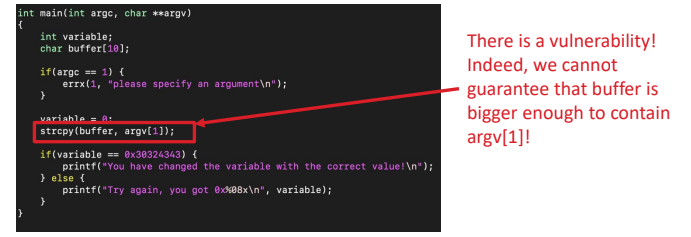

Possiamo osservare che la variabile è allocata nello stack accanto al buffer, ciò significa che possiamo passare al nostro programma un parametro abbastanza lungo da sovrascrivere il contenuto della variabile.

### Stack corruption

Possiamo ora considerare un diverso tipo di exploit del buffer overflow che ci permette di modificare l'indirizzo di ritorno di una funzione.
Questo attacco può essere utilizzato per eseguire qualsiasi altra funzione nel nostro programma!
Considereremo prima i binari a 32 bit, poi discuteremo il caso a 64 bit.

Procedura e caso d'esempio:
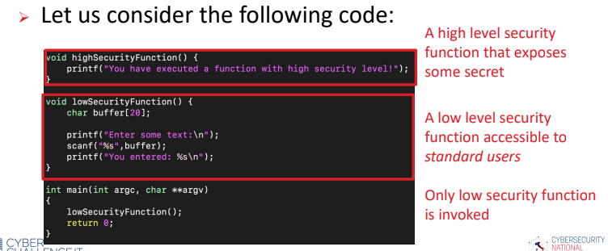

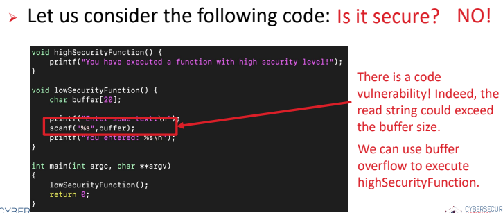

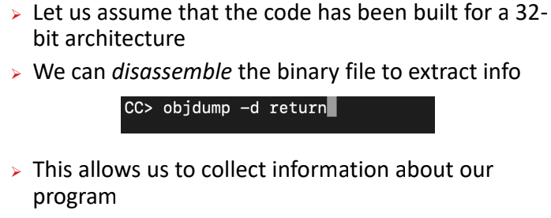

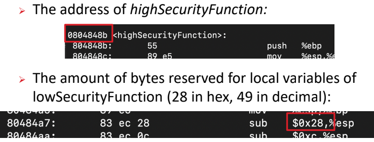

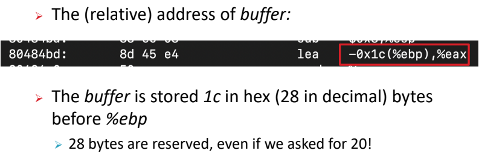

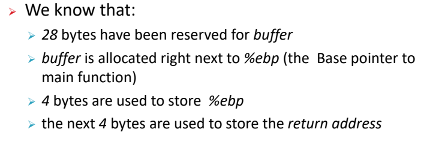

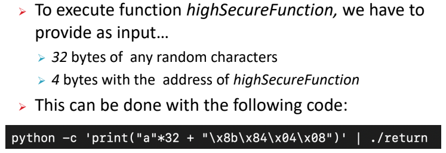

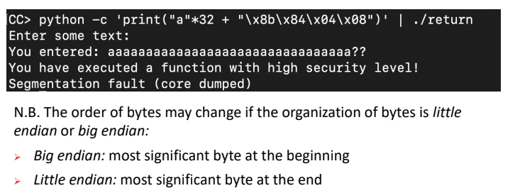

Nell'ultimo esempio abbiamo considerato un'architettura x86.

- L'approccio è simile in un'architettura x86-64, tuttavia in questa architettura gli indirizzi vengono gestiti in modo diverso:
  - Tutti i 2^64 byte non vengono utilizzati per lo spazio degli indirizzi.
  - Vengono utilizzati solo i 48 bit meno significativi.
- Gli indirizzi devono avere una forma canonica e gli unici indirizzi validi sono compresi nell'intervallo:
  - Da 0x0000000000000000 a 0x00007FFFFFFFFFFFF
  - Da 0xFFFF800000000000 a 0xFFFFFFFFFFFFFF
- Dobbiamo garantire che un indirizzo iniettato rispetti la forma canonica, altrimenti viene generata un'eccezione.

### Heap overflow

L'overflow dell'heap (o corruzione dell'heap) indica un'azione (o una sequenza di azioni) che corrompe il contenuto dell'heap.
Lo sfruttamento dell'overflow dell'heap viene eseguito in modo diverso rispetto allo stack overflow:

- La memoria nell'heap viene allocata dinamicamente.
- L'obiettivo dell'attacco è modificare le strutture interne del programma, come i puntatori alle liste concatenate.

### Code injection

Gli aggressori sfruttano le falle del software per introdurre codice dannoso in un programma informatico vulnerabile:

1. Alcune istruzioni vengono iniettate sfruttando una delle sezioni di input
2. Il flusso del programma viene reindirizzato a esse

Esempio shellcode injection

Mirato all'esecuzione di un comando shell:

- Attacco molto diffuso contro server remoti
- Il payload iniettato è semplicemente una chiamata di sistema che invoca il terminale (situato in /bin/sh nei sistemi Unix)
- Una volta ottenuta una shell, è possibile inviare qualsiasi comando al sistema, creare qualsiasi file non autorizzato, rubare qualsiasi informazione, ecc.

Per sfruttare questa vulnerabilità, un aggressore può:

- sovrascrivere il valore del registro eip per fare riferimento a un'area di memoria che controlla
- riempire quell'area con uno shellcode, ovvero un insieme di istruzioni assembly che generano una shell

- Sono disponibili strumenti per generare questi codici, come, ad esempio, la libreria Python pwntools
- Lo shellcode è dipendente dalla macchina!
- Per eseguire questo attacco, lo stack deve essere eseguibile

L'iniezione di shellcode consiste nei seguenti passaggi:

1. Verificare se un buffer overflow può essere utilizzato per corrompere lo stack
2. Iniettare il codice shell nello stack
3. Identificare l'indirizzo a cui saltare

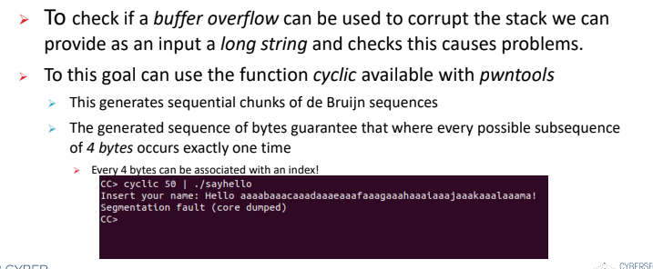

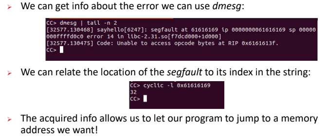

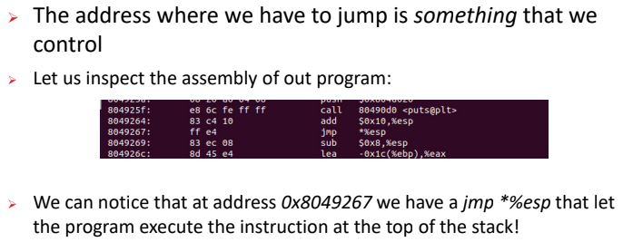

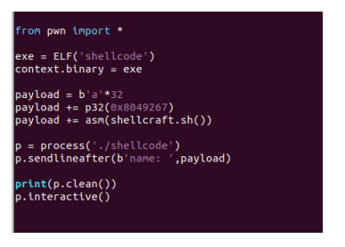

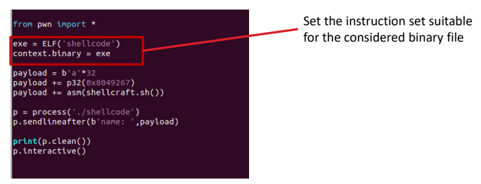

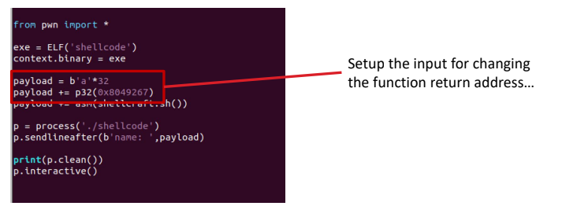

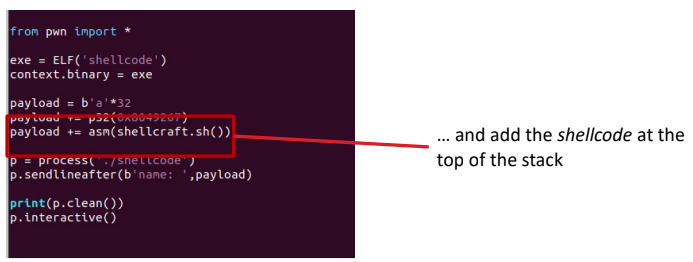

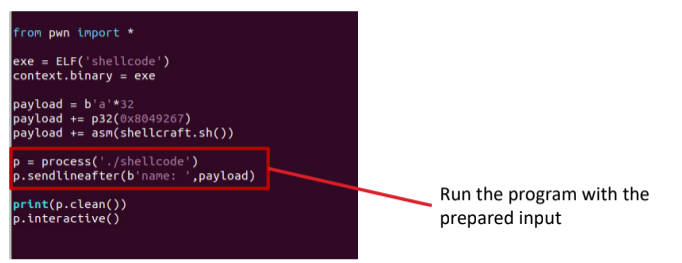

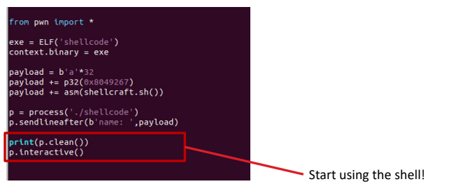

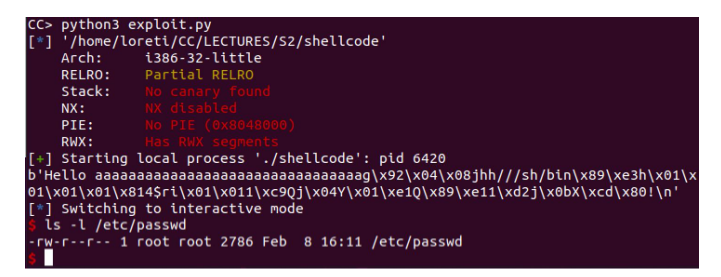
