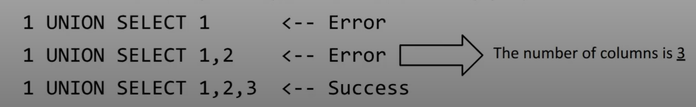
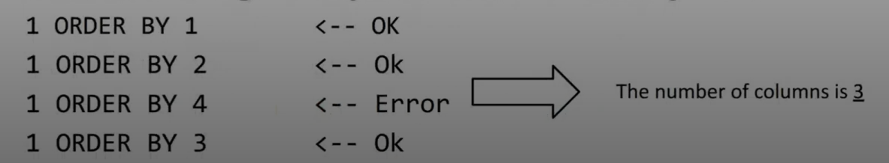

# Web Security 2

La stragrande maggioranza di servizi si appoggiano ai database che possono essere relazionali o non relazionali.
Un attacco importante è quello dell'SQL injection, viene inserito del codice sql malevolo che può compromettere l'integrità dei dati o visualizzare le informazioni contenute in esso.
Se un input non è gestito in modo opportuno esempio con sanificazione questo può essere fattibile.

Un esempio in una situazione di login è la seguente:
SELECT \* FROM users WHERE email = '<b>' or 1=1 -- </b>'and password=''

In questo caso l'utente potrà scoprire tutte le row della tabella users e rubare account.

Caratteri speciali:

- ' -> termina stringa sql
- \ -> escaping
- " -> termina stringhe in mysql esempio

### Union-Based SQL injections:

L'utilizzo dell'operatore union è spesso utilizzato quando il risultato viene mostrato all'utente, questo permette di visualizzare molti più dati.

Esempio: SELECT col_1, col_2 FROM table1 UNION SELECT col_3, col_4 FROM table2;

La prima e la seconda query devono selezionare lo stesso numero di colonne e per ogni colonna deve restituire lo stesso tipo di dato su ogni colonna.
L'errore restituito può essere utile per capire come è costruito il database.

Un esempio di query malevola: SELECT column_1 FROM table WHERE column_2 = <b>1 UNION SELECT secret FROM secrets</b>

In ambiente black-box è importante scoprire il numero di colonne della query originale. Nell'immagine sotto indicata spiega un metodo semplice per capire il numero di colonne



Per determinare il numero di colonne un altro metodo è quello di usare order by, così facendo io quando inserisco un numero dopo la order by indica il numero della colonna, se va in errore vuol dire che il numero di colonne restituito è inferiore. Questo metodo è più efficiente.



Alcune query hanno però un limit 1, quindi riesco a eseguire la query con la union solo se la prima query non mi restituisce niente.
Esempio: SELECT c1, c2, c3 FROM table WHERE c1 = <b>1 AND 1 = 0 UNION SELECT 1,2,3</b>

La struttura del DB non è sempre conosciuta specialmente in blackbox.
Per conoscere meglio la struttura del db il passo base è il seguente:

- INFORMATION_SCHEMA.schemata -> lista di tutti gli schema presenti nel db
- INFORMATION_SCHEMA.table -> lista di tutte le tabelle presenti nel db
- INFORMATION_SCHEMA.columns -> lista di colonne presenti in un db

```mysql
SELECT table_name FROM information_schema.tables WHERE table_schema = 'someschema';

SELECT col_name FROM information_schema.columns WHERE table_name = 'sometable';

SELECT table_name, column_name FROM information_schema.columns WHERE table_schema = DATABASE();
```

### Blind SQL injections

Sfrutti il sistema come un oracolo, capisci e mappi la struttura del database, ma non hai un output.
Se ad esempio si vuole scoprire la pw di un utente puoi andare per tentativi:

- se il primo carattere è uguale ad: 'a' SI/NO
- secondo carattere è uguale ad: "a" NO
- terzo carattere è uguale a: "b" SI ecc ecc..

Il modo migliore di capire le risposte è quello di farsi restituire un true o false per ogni interrogazione, successivamente passare all'automazione di tutto ciò sfruttando uno script.

Nell'esempio sotto mostrato viene restituita la row solamente se la mia espressione che scrivo in un secondo momento è vera.
Esempio di interrogazione: SELECT \* FROM posts WHERE id = <b>1 AND (SELECT 1 FROM users WHERE id=1 AND SUBSTR(password, 4, 1)) = 1</b>

Operatori:

- LIKE confronta stringhe (case insensitive), può confrontare anche se una stringa contiene una parte di una stringa usando operatori come %
- SUBSTR preleva una sottoparte della stringa.

Una ulteriore strategia è la time-based SQL injections, se eseguiamo una sleep quando una condizione è vera allora in base al tempo di attesa della risposta capiremo se il risultato è avvenuto con successo o meno.
Esempio: SELECT sleep(1) FROM secrets WHERE secret LIKE 'a%' LIMIT 1;

### Preventing SQL injection

Come prevenire:

- Escaping di tutto -> sostituzione di caratteri speciali come apostrofi
- template già preparati -> inserimento di segnaposti con sanificazione di elementi
- ORM libreria che mappa gli oggetti di un linguaggio di programmazione agli schema del db

## Logic Vulnerabilities

Difetti nella logica applicativa di un portale.

### Business logic vulnerabilities

Errori logici nell'applicazione, dipende dal comportamento dell'applicazione stessa.
Ci sono 3 cause principali:

- Access Control Issue
- Wrong assumption of the user behavior
- Flawed handling of an incorrect input

### Access Control Issue

Funzionalità non protette, autorizzazioni mal gestiti, esempio api che non fa controlli di privilegio.
Ogni funzionalità vanno testate per ogni tipologia di utente, per verificare le vulnerabilità.
Con AuthMatrix si possono automatizzare questi test.
Limitazione degli utenti riferita solo a una serie di metodi, a tal punto può essere raggirata.

### Incorrect input handling

Gli input vanno sempre verificati e validati attraverso un tipo e delle business rules lato backend.
Ricordati inoltre che i controlli lato client ad esempio un disabled relativo ad un input può essere facilemente raggirato dalla devtools di chrome.
Così facendo se il backend non fa opportuni controlli posso modificare alcuni campi del db o trovarmi in situazioni particolari. Un esempio è il prezzo di un prodotto in un ecommerce.
